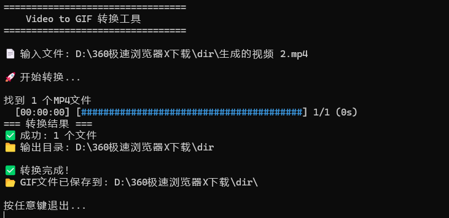

# Video to GIF 转换工具

一个简单易用的命令行工具，用于将MP4视频文件转换为GIF动图。支持批量处理文件夹或单个文件转换。

## 演示效果



## 功能特性

- 🎬 批量转换：一次性处理文件夹中的所有MP4文件
- 📄 单文件转换：支持拖拽单个MP4文件进行转换
- 🖱️ 拖拽支持：直接将文件夹或文件拖拽到工具上即可开始转换  
- ⚡ 高效处理：基于Rust开发，性能优异
- 🎯 简单易用：无需复杂配置，开箱即用
- 📦 内置FFmpeg：无需单独安装，下载即用

## 技术栈

- **Rust** - 系统编程语言，保证高性能和内存安全
- **FFmpeg 7.1.1** - 内置视频处理库，无需单独安装

## 系统要求

- Windows 7/10/11 (64位)
- macOS 10.14+ (64位)
- Linux (64位)

**无需安装任何依赖软件！** 本工具已内置FFmpeg，下载即可使用。

## 快速开始

### 下载安装

**方式一：下载发布版本**
1. 前往 [Releases](../../releases) 页面下载对应系统的可执行文件
2. 解压到常用目录（如桌面）
3. **就这么简单！** 无需安装FFmpeg或其他依赖

**方式二：从源码构建**
1. 克隆项目：`git clone <repository-url>`
2. 运行构建脚本：`build-and-release.bat`
3. 使用 `releases/` 目录中的文件

### 使用方法

#### 方法一：拖拽使用（推荐）

**批量转换文件夹：**
1. 准备一个包含MP4文件的文件夹
2. 直接将文件夹拖拽到 `video-gif.exe`（Windows）或 `video-gif`（macOS/Linux）上
3. 工具会自动开始转换，转换完成的GIF文件将保存在同一文件夹中

**单个文件转换：**
1. 准备一个MP4视频文件
2. 直接将MP4文件拖拽到 `video-gif.exe`（Windows）或 `video-gif`（macOS/Linux）上
3. 工具会自动开始转换，转换完成的GIF文件将保存在原MP4文件的同一目录中

#### 方法二：命令行使用
```bash
# 批量转换文件夹 (Windows)
./video-gif.exe "C:\path\to\your\video\folder"

# 单个文件转换 (Windows)
./video-gif.exe "C:\path\to\your\video.mp4"

# 批量转换文件夹 (macOS/Linux)
./video-gif "/path/to/your/video/folder"

# 单个文件转换 (macOS/Linux)
./video-gif "/path/to/your/video.mp4"
```

#### 方法三：高级选项
```bash
# 自定义帧率和宽度
./video-gif.exe --fps 15 --width 640 "C:\path\to\video\folder"

# 静默模式（不显示进度条）
./video-gif.exe --quiet "C:\path\to\video\folder"

# 查看所有选项
./video-gif.exe --help
```

## 转换设置

默认转换设置：
- **输出格式**：GIF
- **帧率**：10 FPS（可有效控制文件大小）
- **分辨率**：自动调整（宽度限制为480px）
- **输出位置**：与原MP4文件相同目录

转换后的文件命名规则：`原文件名.gif`

**输出位置说明：**
- 批量转换：GIF文件保存在原文件夹中
- 单文件转换：GIF文件保存在原MP4文件的同一目录中

## 项目结构

```
video-gif/
├── src/
│   ├── main.rs              # 主程序入口
│   ├── converter.rs         # 视频转换逻辑
│   └── utils.rs             # 工具函数
├── docs/
│   └── demo1.png            # 演示截图
├── releases/                # 发布目录（自动生成）
│   ├── video-gif.exe        # 主程序
│   ├── ffmpeg.exe           # 内置FFmpeg
│   ├── video-gif.bat        # 拖拽脚本
│   ├── README.MD            # 使用说明
│   └── LICENSE              # 许可证
├── ffmpeg.exe               # 内置FFmpeg (Windows)
├── Cargo.toml               # 项目配置
├── Cargo.lock               # 锁定依赖版本
├── README.MD                # 项目说明
├── LICENSE                  # MIT许可证
├── .gitignore               # Git忽略文件
├── video-gif.bat            # Windows拖拽支持脚本
├── build.bat                # 传统构建脚本
├── build-and-release.bat    # 综合构建发布脚本
├── post-build.bat           # 构建后自动更新脚本
├── update-release.bat       # 手动更新发布脚本
├── demo.bat                 # 演示脚本
└── TODO.md                  # 开发计划
```

## 常见问题

### Q: 需要安装FFmpeg吗？
A: **不需要！** 本工具已内置FFmpeg 7.1.1，下载即可使用。

### Q: 转换速度很慢怎么办？
A: 转换速度取决于视频文件大小和系统性能。较大的视频文件需要更多时间处理。

### Q: 生成的GIF文件很大怎么办？
A: 可以使用 `--fps` 和 `--width` 参数调整输出质量：
```bash
# 降低帧率和分辨率以减小文件大小
./video-gif.exe --fps 8 --width 320 "视频文件夹"
```

### Q: 支持其他视频格式吗？
A: 目前主要支持MP4格式。由于内置了完整的FFmpeg，理论上支持大多数视频格式，但建议使用MP4以获得最佳兼容性。

### Q: 文件名包含特殊字符（如括号、空格）会有问题吗？
A: 不会！工具已经过优化，完全支持包含括号、空格、中文等特殊字符的文件名和路径。例如："未命名项目 (1).mp4" 这样的文件名可以正常处理。

### Q: 工具文件很大是为什么？
A: 因为内置了完整的FFmpeg库（约87MB），这样可以确保在任何系统上都能正常工作，无需用户单独安装依赖。

## 开发指南

### 构建项目

**开发模式构建：**
```bash
# 编译项目
cargo build --release

# 自动更新发布文件
post-build.bat
```

**完整发布构建：**
```bash
# 一键构建和发布
build-and-release.bat
```

**构建脚本说明：**
- `cargo build --release` - 编译项目到 `target/release/`
- `post-build.bat` - 自动将编译结果复制到 `releases/` 目录
- `build-and-release.bat` - 完整的构建和发布流程
- `update-release.bat` - 手动更新发布文件

### 文件组织

- **开发文件**: 源码保存在 `src/` 目录
- **发布文件**: 自动生成到 `releases/` 目录
- **根目录**: 不保存可执行文件，避免版本混乱

## 贡献指南

欢迎提交Issue和Pull Request！

1. Fork本项目
2. 创建特性分支：`git checkout -b feature/new-feature`
3. 提交更改：`git commit -am 'Add new feature'`
4. 推送分支：`git push origin feature/new-feature`
5. 提交Pull Request

## 许可证

MIT License - 详见 [LICENSE](LICENSE) 文件

## 更新日志

### v1.2.2
- 📸 添加演示截图，直观展示工具效果
- 👤 更新作者信息和联系方式
- 🙏 添加感谢部分，致谢支持者
- 📚 完善项目文档结构

### v1.2.1
- 🐛 修复批处理脚本对包含括号等特殊字符的文件名处理问题
- ✅ 完全支持中文、空格、括号等特殊字符的文件名和路径
- ✅ 改进错误处理，避免脚本闪退
- ✅ 优化自动化构建和发布流程

### v1.2.0
- 🎉 新增单个MP4文件转换支持
- ✅ 支持拖拽单个MP4文件进行转换
- ✅ GIF文件自动保存到原MP4文件目录
- ✅ 改进批处理脚本，同时支持文件夹和文件拖拽
- ✅ 更新帮助信息和用户界面

### v1.1.0
- 🎉 内置FFmpeg 7.1.1，无需单独安装
- ✅ 支持自定义帧率和分辨率
- ✅ 添加静默模式
- ✅ 改进命令行参数支持

### v1.0.0
- 🎉 首次发布
- ✅ 支持MP4到GIF转换
- ✅ 支持拖拽操作
- ✅ 批量处理功能

---

## 联系方式

如有问题或建议，请通过以下方式联系：

- 📧 Email: g278780765@gmail.com
- 🐛 Issues: [GitHub Issues](../../issues)
- 💬 Discussions: [GitHub Discussions](../../discussions)

## 鸣谢

特别感谢以下组织和个人对本项目的支持：

- 🏢 **泉州双源智能科技** - 技术支持与指导
- 🛠️ **FFmpeg 项目** - 提供强大的视频处理能力
- 🦀 **Rust 社区** - 提供优秀的开发工具和生态

---

**享受使用 Video to GIF 转换工具！** 🎬➡️🎞️
